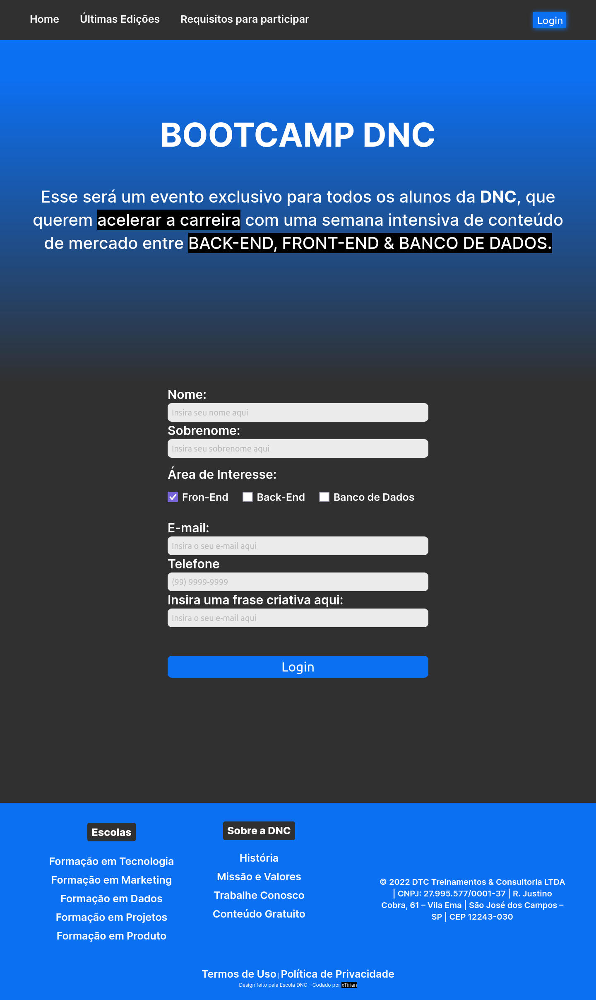
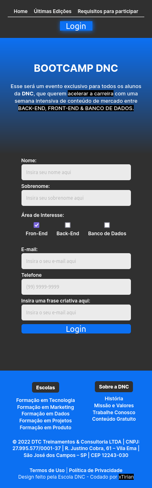

# Bootcamp - DNC

Este projeto é um exercício proposto pela Escola DNC para o curso de formação em Tecnologia. Porjeto com o intuito de praticar a criação de formulários e a organização da página com display Grid e display Flex combinados no deccorrer da tela.

## Tabela de Conteúdos

- [Visão Geral](#overview)
- [Resultados](#screenshot)
- [Meu Processo](#my-process)
- [Tecnologias usadas](#built-with)
- [O quê aprendi](#what-I-learned)
- [Continuação do desenvolvimento](#continue-development)

## Overview

Uma nota do

### Screenshot

Mobile:


Web:


### Links

- Repositório Git: [Clique aqui](https://github.com/xtirian/DNC-Exercicios/tree/main/0.Bootcamp%20-%20DNC)
- Deploy: [Clique aqui](https://bootcamp-dnc-snowy.vercel.app)

## My process

### Built with

- Semantic HTML 5 markup
- CSS custom properties
- Flexbox
- CSS Grid
- Mobile-first workflow

### What I learned

Neste projeto tive a oportunidade de utilizar pela primeira vez a aplicação de seletores de atributo ou "seletores de subelemento que eu usei principalmente no form checkbox; e também o seletor root para criar variáveis no CSS.
Além disso, pela primeira vez acertei o linear-gradient de primeira, sem precisar consultar a documentação.

```css
:root {
  --primary-color: #303030;
  --secondary-color: #0c70f2;
  --bg-adjust: #3030308c;
}

main {
  background: linear-gradient(
    var(--secondary-color) 5%,
    var(--primary-color) 45%,
    var(--primary-color) 100%
  );
}

[type="checkbox"] {
  width: 25px;
  height: 25px;
}
```

Além disso, tive a oportunidade de praticar algumas coisas que estou estudando por fora, que é meios de fazer os projetos mais rápido ou mais organizado. Com o método do Mobile-first workflow que estou praticando, o processo de adaptar as media-querry foram muito mais proveitosas.

Eu iniciei o processo organizando o CSS em 5 grandes partes:

- Variáveis
- Resets
- Fonts
- Estilos Base
- Estilo Mobile

Depois de pronto o mobile, adicionei a versão desktop.

Também aproveitei e pratiquei o uso de variáveis no CSS que aprendi, também, durante o estudo sobre o método do mobile-first workflow

### Continued development

Vou continuar estudando e aplicando os conceitos de mobile first que estou estudando off curso e continuar o trabalho nas aulas.

## Author

- Portifólio - [Clique aqui](https://xtirian.netlify.app/)
- Linkedin - [Clique aqui](https://www.linkedin.com/in/mf-cunha/x)
- GitHub - [Clique aqui](https://github.com/xtirian/)
