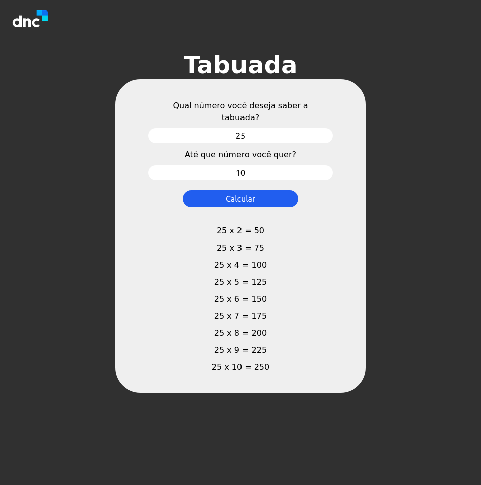

# Tabuada - DNC

Este projeto é um exercício proposto pela Escola DNC para o curso de formação em Tecnologia. Porjeto com o intuito de praticar a criação uma tabuada usando os elemento de manipulação de DOM do JavaScript.

## Tabela de Conteúdos

- [Visão Geral](#overview)
- [Resultados](#screenshot)
- [Links](#links)
- [Meu Processo](#my-process)
- [Tecnologias usadas](#built-with)
- [O quê aprendi](#what-I-learned)
- [Continuação do desenvolvimento](#continue-development)

## Overview

### Screenshot

Web:


### Links

- Repositório Git: [Clique aqui](https://github.com/xtirian/DNC-Exercicios/tree/main/1.Tabuada%20-%20DNC)
- Deploy: [Clique aqui](https://tabuada-dnc-pink.vercel.app/)

## My process

### Built with

- HTML/ CSS
- JavaScript
- Mobile-first overflow

### What I learned

Pratiquei os seguintes comandos :

```javascript
var valor = window.document.getElementById("valor1").value;
//E pra ir mais além aproveitei e testei como criar elementos dentro do HTML, por isso pode estar um pouco diferente do resultado da aula

resposta = window.document.createElement("p");

// E

respostaSect.appendChild(resposta);
```

## Author

- Portifólio - [Clique aqui](https://xtirian.netlify.app/)
- Linkedin - [Clique aqui](https://www.linkedin.com/in/mf-cunha/x)
- GitHub - [Clique aqui](https://github.com/xtirian/)
